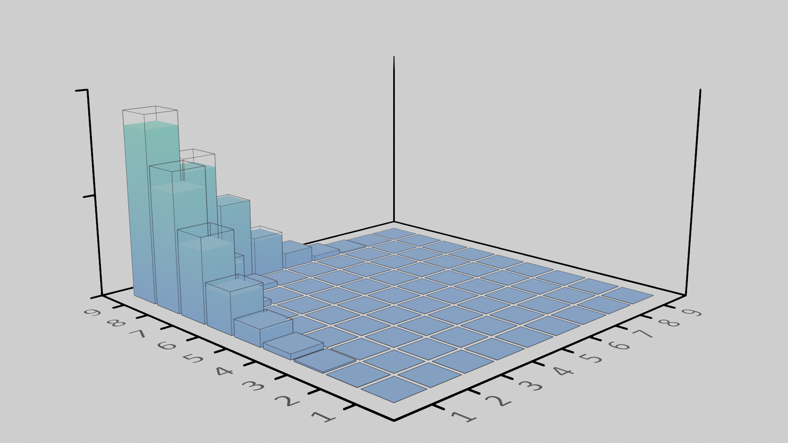
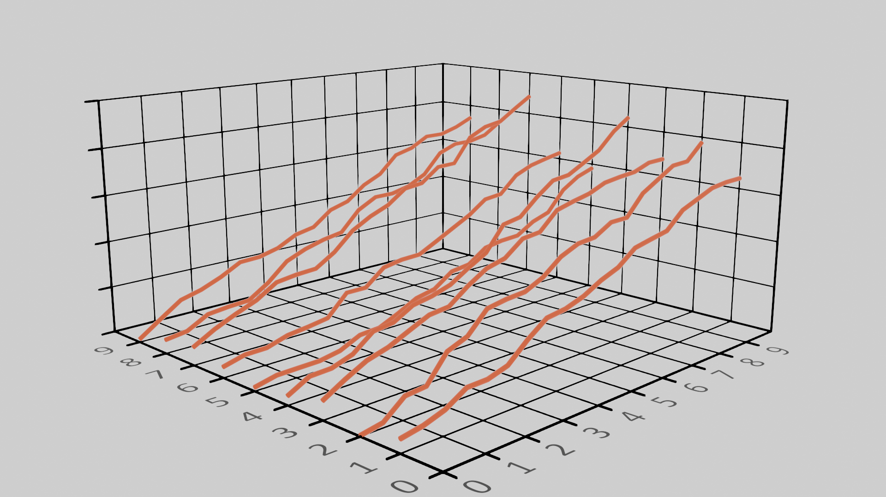
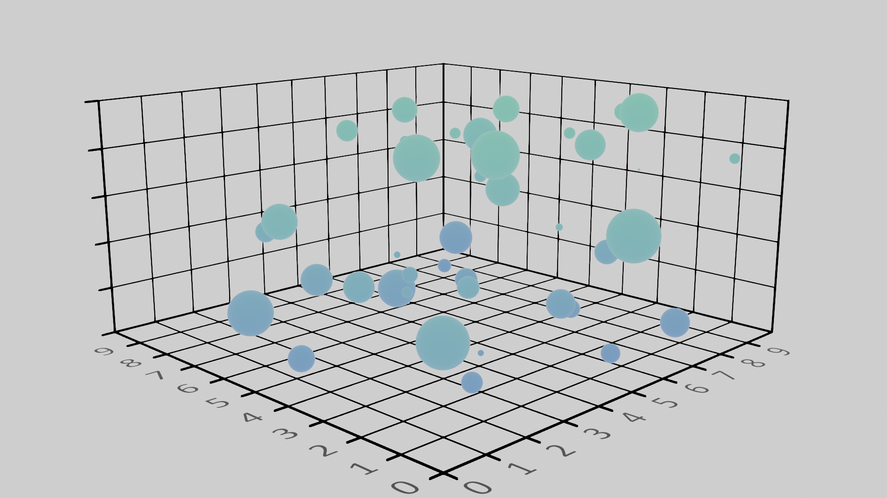

# blendvis: Blender Visualization Tool for 3D Scientific Plotting 

## Quick Start
The aim of `blendvis` is to use simple Python syntax for scientific plotting 
with the full 3D rendering (and animation) capabilities of [Blender](https://www.blender.org/).
The library uses similar commands to the `matplotlib` library and uses standard numerical data types such as `numpy` arrays.
The data is converted to an appropriate Blender scene and rendered using ray-tracing for high-quality 3D images.

## Examples
Some simple examples of `blendvis` plots.
### Bar plot
```
import blendvis

# simulate some experimental and theoretical data
M, N, H = 10, 10, 30
x, y = np.arange(1, M), np.arange(1, N)
X, Y = np.meshgrid(x, y)
Zth = H * np.exp( - (X * np.flip(Y))**2 / 10 )
Zex = Zth * np.random.uniform(0.8, 1, Zth.shape)

## create a figure axes
ax = blendvis.axes.Axes(verbose=False, use_latex=False)

# plot the data
ax.bar(X, Y, Zex, mat=mat, **dict(bevel=True, wireframe=False))
ax.bar(X, Y, Zth, mat='black', **dict(bevel=False, wireframe=True))

# change the look of the plot
ax.set(xlim=[0, M], ylim=[0, N], zlim=[0, H])
ax.set_xticklabels(xticks=x)
ax.set_yticklabels(yticks=y)
ax.set_zticklabels(zticks=np.linspace(0, H, 3).astype('int'))
ax.grid = False
ax.show()
```


### Line plot
```
import blendvis

# create figure axes
ax = blendvis.axes.Axes(verbose=False)

# generate data
num, points = 10, 100
theta = np.linspace(0, 2*np.pi, points)
r = np.linspace(0, 5, points)

# plot each line
for step in range(1, num, 1):
    x = np.linspace(0, num, 20)
    y = np.ones_like(x) * step
    z = np.cumsum(np.abs(np.random.normal(0.1, 0.2, x.shape)))
    ax.line(x=x, y=y, z=z, mat=flat)

# change the look 
ax.set(xlim=[0, num], ylim=[0, num], zlim=[0, 5])
ax.set_xticklabels(xticks=np.arange(0, num, 1))
ax.set_yticklabels(yticks=np.arange(0, num, 1))
ax.set_zticklabels(zticks=np.linspace(0, 5, 6))
ax.show()
```


### Scatter plot
```
import blendvis

# create figure axes
ax = blendvis.axes.Axes(verbose=False)

# simulate data
num, range = 40, 10
x = np.random.uniform(0, range, num)
y = np.random.uniform(0, range, num)
z = np.random.uniform(0, range, num)
s = np.random.uniform(0, 0.5, num)

# plot data
ax.scatter(x, y, z, s, mat=mat)

# change look
ax.set(xlim=[0, range], ylim=[0, range], zlim=[0, range])
ax.set_xticklabels(xticks=np.arange(0, range, 1))
ax.set_yticklabels(yticks=np.arange(0, range, 1))
ax.set_zticklabels(zticks=np.linspace(0, range, 6))
ax.show()
```


## Installing
`blendvis` must be run via an instance of Blender. 
First [download](https://www.blender.org/download/) and install Blender (tested on 2.93 LTS version).
Download the source code and install as an add-on in Blender (Edit -> Preferences -> Add-ons -> Install).

## Features
Currently `blendvis` enables:
* bar, scatter, and line plots
* various colors, materials, and color maps
* LaTeX rendering (further testing needed)
* choose any system font

In the future, I hope to add:
* surface plots, tri plots
* subplots
